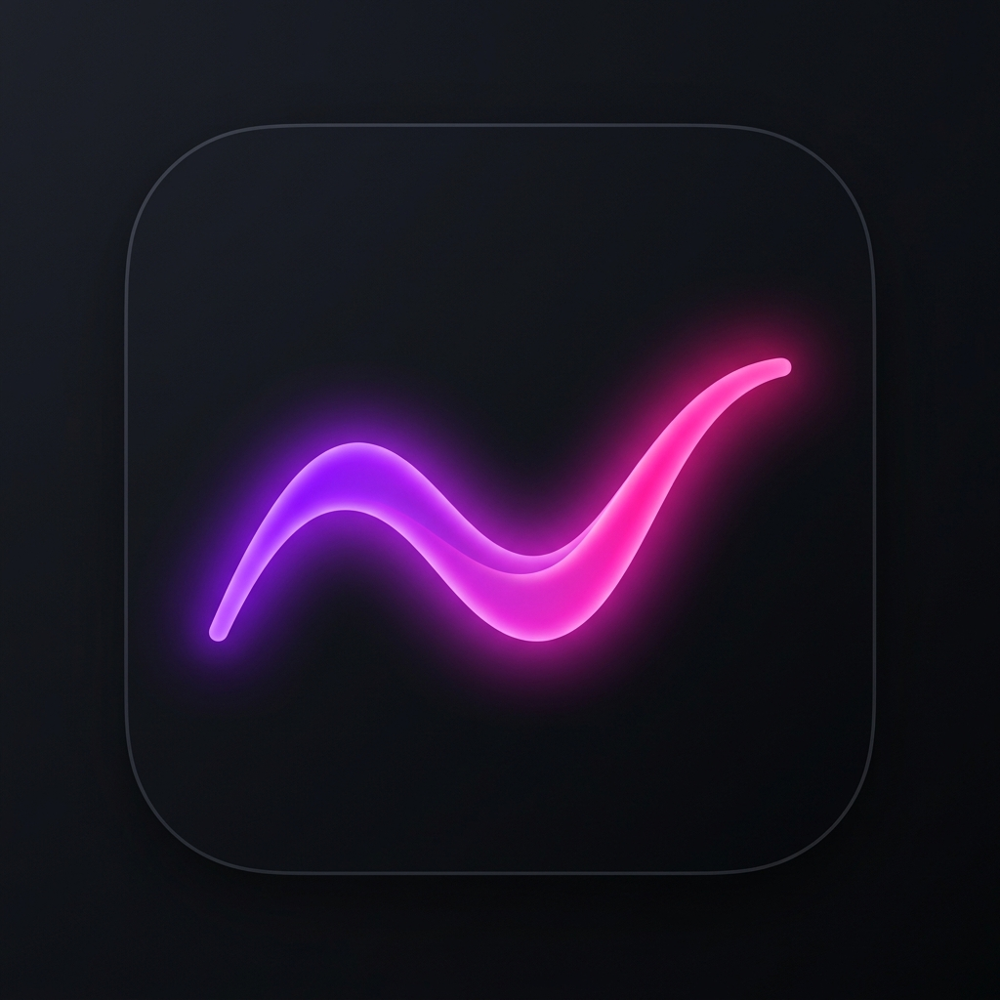

<div align="center">
  
  
  # Aurora

  **A next-generation Pomodoro timer with AI accountability and gamification.**

  [](https://github.com/cavalinho-xdd/focus/releases)
  [](#)
</div>

<br />
Aurora is not just another Pomodoro timer. It is an aggressive, gamified productivity tool built to physically prevent procrastination and hold you accountable using artificial intelligence.

## ✨ Key Features

* 🛡️ **Hardcore Mode**
  Once a focus session starts, the app cannot be closed, minimized, or bypassed. Alt+F4 is disabled. You are locked in until the timer hits zero.
* 🤖 **AI Evaluation Engine (Google Gemini)**
  At the end of your session, the app uses Google Gemini AI to ask you specific questions about what you studied or worked on. If you can't answer, you lose your streak!
* 🍅 **Pomodoro Integration**
  Customizable focus blocks and breaks designed around the proven Pomodoro technique.
* 🏆 **Gamification & Progression**
  Earn XP, level up, and maintain daily streaks to stay motivated over the long term.
* 🌍 **Bilingual**
  Full support for both English and Czech languages.

## 🚀 Download & Install

Aurora is available for all major operating systems. Head over to the [Releases](https://github.com/cavalinho-xdd/focus/releases) page to download the latest version:

* **Windows**: Download `Aurora-Setup-X.X.X.exe`
* **macOS (Apple Silicon)**: Download `Aurora-X.X.X-arm64.dmg`
* **Linux**: Download `.AppImage` or `.deb`

*Note: As this is an indie project, the installers are not yet digitally signed with a commercial certificate. You may need to click "Run anyway" on Windows SmartScreen or "Open" via right-click on macOS.*

## 🛠️ Tech Stack

* **Core**: [Electron](https://www.electronjs.org/)
* **Frontend**: [React](https://reactjs.org/) + [Vite](https://vitejs.dev/)
* **Styling**: [Tailwind CSS](https://tailwindcss.com/)
* **Animations**: [Framer Motion](https://www.framer.com/motion/)
* **AI Integration**: [@google/genai](https://github.com/google/generative-ai-js)
* **Packaging**: [electron-builder](https://www.electron.build/)

## 💻 Development

Want to build Aurora locally or contribute? It's easy!

### Prerequisites
* Node.js (v20 or higher)
* Git

### Setup
```bash
# Clone the repository
git clone https://github.com/cavalinho-xdd/aurora.git
cd aurora

# Install dependencies
npm install

# Start the development server
npm run dev

# In a separate terminal, start the Electron app
npm start
```

### Building for Production
To package the app for your current operating system:
```bash
npm run package:win   # For Windows
npm run package:linux # For Linux
npm run package:mac   # For macOS
```

## 💖 Support the Project

Aurora is a passion project built by a solo student developer. It is 100% free. If you find the app helpful and want to support its continued development (and help cover the costs of the Apple Developer Certificate to remove those scary macOS warnings!), you can buy me a coffee:

<a href='https://ko-fi.com/cavalinho-xdd' target='_blank'></a>

## 🐛 Bug Reports & Feedback

Found a bug or have a feature request? Please [open an issue](https://github.com/cavalinho-xdd/aurora/issues) on GitHub or use the "Report a Bug" button directly inside the app.

---
<div align="center">
  Built with ❤️ to stop procrastination.
</div>
