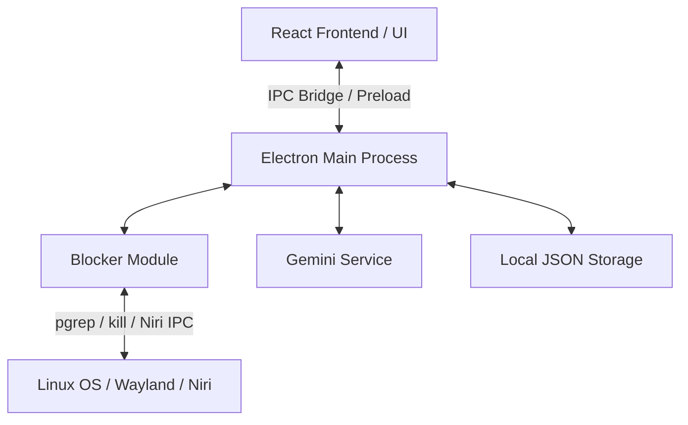

# Procrastination Helper — Technický Kontext a Architektura (context.md)

Tento dokument slouží jako detailní zadání a architektonický průvodce pro vývojáře (nebo dalšího AI agenta), který bude aplikaci stavět od základů. Původní prototyp (PHP, SQLite, statické HTML) je zastaralý a celý projekt se staví **from scratch**.

---

## 🛠️ Technologický Stack

Aplikace bude postavena na moderních cross-platform technologiích s důrazem na nízkou režii a vynikající vizuální stránku.

1. **Běhové prostředí**: **Electron** (Node.js na pozadí, Chromium na popředí).
2. **Frontend Framework**: **Vite + React** (umožní rychlé sestavení UI a snadnou správu stavu časovače, bodů a nastavení).
3. **Styling**: **Vanilla CSS** s využitím moderních CSS proměnných (HSL, CSS Grid/Flexbox, `backdrop-filter` pro glassmorphismus, klíčové snímky pro plynulé animace a glow efekty).
4. **AI Integrace**: **Google Gemini API** (model `gemini-2.5-flash` přes nativní HTTPS `fetch` volání z hlavního procesu Electronu).
5. **Ukládání dat**: Lokální JSON soubor (`userdata.json`) uložený v adresáři pro uživatelská data aplikace (`app.getPath('userData')`). Tím se vyhneme nutnosti kompilovat nativní SQLite moduly.

---

## 🏗️ Architektura Aplikace

Aplikace se dělí na dvě hlavní části propojené přes bezpečný **Preload bridge (IPC)**.



### 1. Main Process (Hlavní proces — `main.js`)
Spravuje životní cyklus aplikace, nativní okna, systémovou lištu (Tray) a provádí operace vyžadující systémová práva.

*   **`blocker.js`**: Hlídaní a blokování nežádoucích procesů.
    *   **Linux (Niri Compositor)**: Může se napojit na IPC socket Niri (`niri msg action close-window`) nebo klasicky zjišťovat PID procesů přes `pgrep` a posílat jim `SIGKILL`.
    *   **Windows (příprava)**: Bude využívat `tasklist` a `taskkill /F`.
*   **`geminiService.js`**: Komunikace s Gemini API. Bezpečně uchovává API klíč na straně Node.js, aby nebyl vystaven ve frontendu.
*   **`storage.js`**: Jednoduchá obálka nad modulem `fs` pro asynchronní zápis a čtení konfigurace a herních statistik.

### 2. Preload Script (`preload.js`)
Zprostředkovává bezpečný komunikační kanál (API) mezi Reactem a Node.js pomocí `contextBridge`.
*   *Nikdy neexponovat celý modul `child_process` ani `fs` přímo do frontendu z bezpečnostních důvodů!*

### 3. Renderer Process (React Frontend — `src/`)
Moderní jednostránková aplikace (SPA) s čistým stavovým managementem.
*   **Stavový automat**: Hlídá, zda je uživatel v režimu `IDLE` (plánování cíle), `FOCUS` (běží odpočet, blocker je aktivní), `QUIZ` (zobrazují se otázky od AI), nebo `SUMMARY` (vyhodnocení, přičtení bodů).
*   **Designový systém**:
    *   Tmavý režim (Dark mode) jako výchozí.
    *   Harmonické HSL barvy (např. neonově fialová/modrá pro aktivní prvky, sytá šedá pro pozadí karet).
    *   Skleněný efekt (glassmorphismus) pomocí `backdrop-filter: blur(12px)`.

---

## 💬 Specifikace IPC API (Komunikační kanály)

Aplikace bude komunikovat přes následující IPC volání (`ipcRenderer.invoke` a `ipcRenderer.on`):

| Kanál | Parametry | Návratová hodnota | Popis |
| :--- | :--- | :--- | :--- |
| `blocker:start` | `{ blacklist: string[] }` | `void` | Spustí blokování procesů na pozadí. |
| `blocker:stop` | — | `void` | Vypne blokování procesů. |
| `gemini:generate` | `{ topic: string }` | `Array<{ id: number, question: string, hint: string }>` | Asynchronně vygeneruje 3 otázky k tématu. |
| `gemini:evaluate` | `{ qaPairs: Array<{ question: string, answer: string, hint: string }> }` | `{ score: number, feedback: string }` | Vyhodnotí odpovědi uživatele. |
| `storage:load` | — | `{ stats: object, settings: object }` | Načte uložená data ze souboru `userdata.json`. |
| `storage:save` | `{ data: object }` | `boolean` | Uloží data do `userdata.json`. |

---

## 🚀 Krok za krokem: Návod pro vývojáře

Při zahájení práce postupujte následovně:

1.  **Vyčištění repozitáře**:
    *   Přesuňte všechny stávající PHP a HTML soubory do nově vytvořené složky `./legacy-prototype/` (pro případnou referenci), abychom měli čistý pracovní adresář.
2.  **Inicializace projektu**:
    *   Vytvořte `package.json` a nainstalujte Electron a Vite/React:
        ```bash
        npm init -y
        npm install --save-dev electron vite @vitejs/plugin-react
        npm install react react-dom dotenv
        ```
3.  **Implementace Hlavního Procesu (`main.js`)**:
    *   Vytvořte základní okno s rozměry (např. 1024x768), které načítá lokální server Vite při vývoji, nebo hotový build v produkci.
4.  **Vývoj Blockeru (`blocker.js`)**:
    *   Napište robustní kód pro Linux, který kontroluje běžící aplikace. Zkuste nejdříve jednoduchou metodu přes `pgrep` / `kill` a připravte strukturu pro pozdější Windows implementaci (viz `blocker.js` koncept).
5.  **Propojení s Gemini API (`geminiService.js`)**:
    *   Využijte Gemini API a vyžadujte **Structured JSON Output** pomocí promptů, které si vynutí přesný JSON formát.
    *   *Prompt pro generování:*
        ```text
        Jsi učitel. Vygeneruj přesně 3 otázky v češtině, které otestují znalosti na téma: "${topic}".
        Odpověz ve formátu JSON splňujícím toto schéma:
        [{"id": 1, "question": "Otázka?", "hint": "Klíčové pojmy nebo správný směr odpovědi"}]
        ```
    *   *Prompt pro vyhodnocení:*
        ```text
        Vyhodnoť odpovědi studenta na zadané otázky. Porovnej je s nápovědou a zhodnoť jejich správnost.
        Přiřaď celkové skóre od 0 (zcela špatně) do 10 (vynikající porozumění).
        Napiš krátké, motivující zhodnocení v češtině.
        Odpověz ve formátu JSON:
        {"score": 8, "feedback": "Skvělá práce, popsal jsi většinu..."}
        ```
6.  **Vytvoření React UI**:
    *   Vytvořte moderní rozhraní s těmito pohledy:
        *   **Dashboard**: Přehled XP, levelu, posledních cílů a odemčených achievementů.
        *   **Goal Planner**: Zadání cíle, času soustředění a tématu pro AI.
        *   **Timer Screen**: Časovač s plynulou kruhovou animací (SVG circle stroke-dashoffset).
        *   **Quiz Screen**: Interaktivní formulář pro odpovědi na AI otázky se zobrazením výsledného skóre a XP animací.
        *   **Settings Screen**: Správa Gemini API klíče a správa seznamu blokovaných aplikací.
7.  **Propojení a Ladění**:
    *   Propojte frontend přes IPC a ověřte funkčnost blockerů a AI vyhodnocení přímo v běžící aplikaci.
